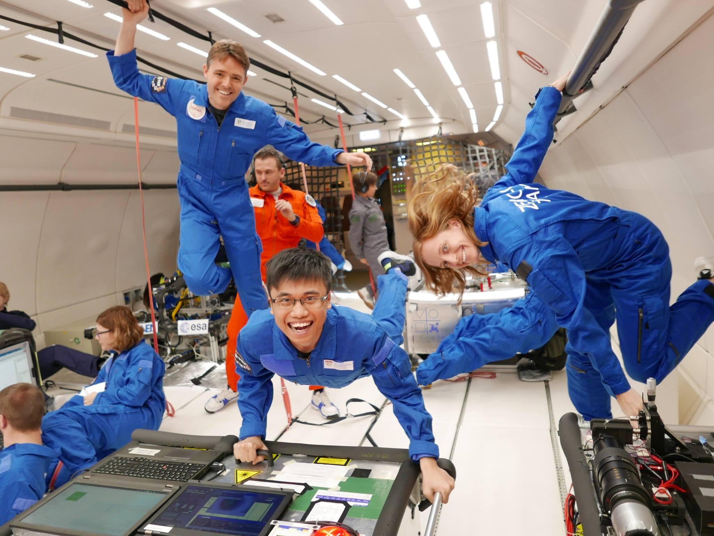
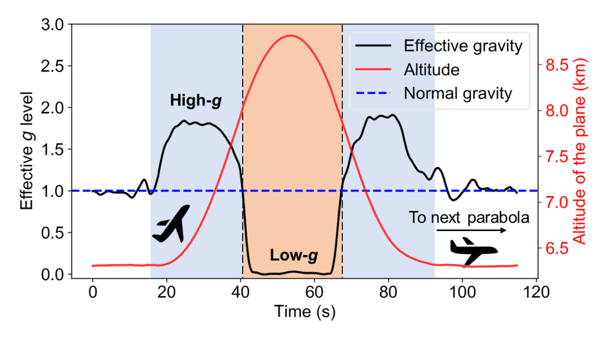
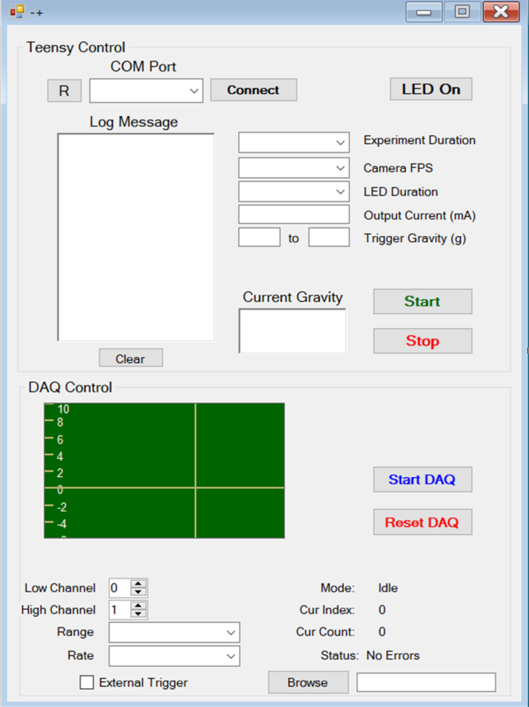

# Automation-in-parabola-flights

## The experiment

Boiling relies on convection, which in turn relies on gravity. So without boiling, like in space station you simply cannot boil water. Recently we discovered a [new boiling mechanism](https://journals.aps.org/prfluids/abstract/10.1103/PhysRevFluids.2.014007) that can work without gravity and this experiment is conducted to prove that.

The experiment is conducted on-board parabolic flight during European Space Agency 67th parabolic flights campaign in Bordeaux, November, 2017. The details of the setup of the experiment and equipment used can by found in the **[notebook file](https://github.com/dmnguyen92/Automation-in-parabola-flights/blob/master/Zero-gravity.ipynb)**.

## The code

During the flight, the experiment runs automatically and is triggered by the gravity level inside the plane's cabin. This is achieved by two programs written by me:
* The first program written in **C++**, to control the functionality of the microcontroller. The code can be found in the ["Teensy 3.6" folder](https://github.com/dmnguyen92/Automation-in-parabola-flights/tree/master/Teensy%203.6).
* The second program written in **Visual Basic**, to control the data acquistion board and construct an user interface. This program is connected with the first program via serial port connection. The code can be found in the folder ["USB 2020"](https://github.com/dmnguyen92/Automation-in-parabola-flights/tree/master/USB2020)

